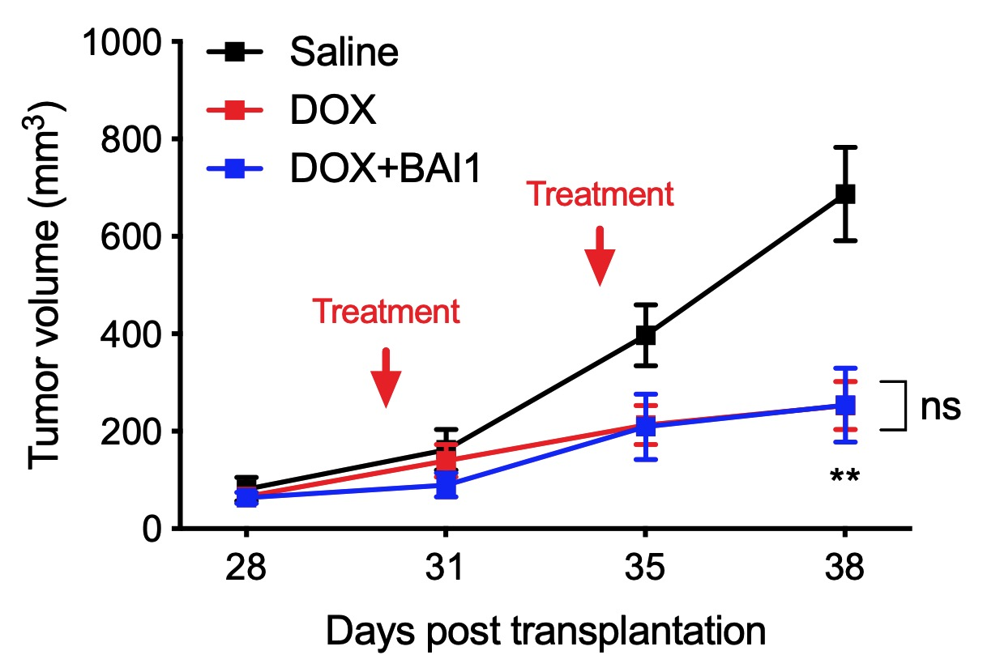

# Power analysis for breast cancer xenograft

Sample size calculations for the breast cancer PDX model were computed using data from the LM2 breast cancer xenograft model.  Power calculations were done via bootstrap sampling in order to ensure that the null hypothesis would be correctly rejected with 80% power at the 0.05 significance level.

Data in `mouse_tumor_volume.csv` corresponds to tumor volumes at Day 38 in Figure 4b.

